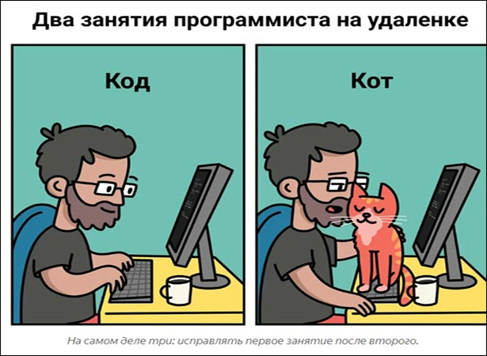

# Инструкция для работы с маркдоун.
Вторая попытка создания ккккконфликта
## Выдееееление текста тест

Что бы выделить текст курсивом заключить его в *звездочки* а полужирным **двойными звездочками**. А так же можно использовать нижнее подчеркивание _например так_ или __Вот так__

Альтернативные способы выделения текста нужны для того что бы можно было совмещать два этих выделения текста. Например _**полужирный курсив**_

## Списки нумерованные и нет
Для создания ненумерованного списка необходимо использовать знак (*) (+) или (-)
- например так
+ или так
* или так
## Работа с изображениями

Что бы вставить изображение в текст необхдимо сделать следующее.

***

## Ссылки

## Работа с таблицами

## Заключение